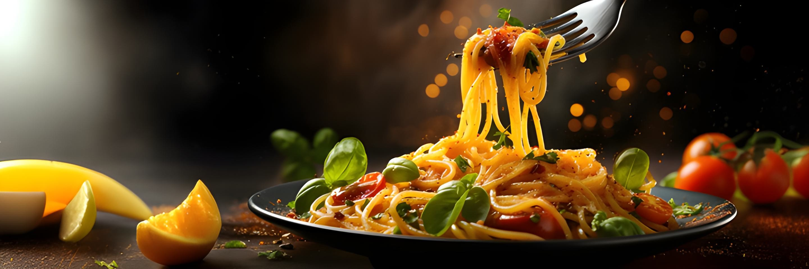

# Recipe Genie 🍲✨

Recipe Genie is a web application that helps users discover recipes based on the ingredients they have on hand. Simply enter your ingredients, and Recipe Genie will provide you with a list of delicious recipes to try.

## Features 🌟

- **Ingredient-based Recipe Recommendations:** Input your ingredients, and Recipe Genie will suggest recipes that you can make with those ingredients.
- **Flexible Search:** Recipe Genie supports a wide range of ingredients, so you can find recipes for almost any combination of items in your pantry.
- **Detailed Recipe Information:** View detailed information about each recipe, including title, description, total time, ingredients, and instructions.
- **Interactive User Interface:** Recipe Genie provides a user-friendly interface that makes it easy to search for recipes and explore new culinary ideas.

## Technologies Used 🛠️

- **Python:** Backend development using Python programming language.
- **Flask:** Web framework used for building the backend server.
- **Pandas:** Data manipulation and analysis library used for handling recipe data.
- **scikit-learn:** Machine learning library used for text vectorization and similarity calculation.
- **HTML/CSS:** Frontend design and styling.
- **JavaScript:** Client-side scripting for dynamic interactions.
- **Render:** Platform used for deploying the application.

## Project Details 📝

1. **Data Collection:** 📊  
The recipe data was scraped from https://pinchofyum.com/ using a Python web scraping tool like Beautiful Soup. The following steps were taken:

- **Identify the Data:** Determined which recipe attributes were necessary (e.g., title, ingredients, instructions).
- **Scraping Process:** Wrote scripts to crawl the website and extract the relevant data. This involved sending HTTP requests to the website, parsing the HTML content, and extracting the desired information.
- **Save the Data:** The scraped data was saved in CSV format for further processing.
 

2. **Data Preprocessing:** 🍅  
Once the data was collected, it required preprocessing. This included:

- **Tokenization:** Split the ingredient text into individual words using NLTK's word tokenizer.
- **Stopwords Removal:** Removed common English stopwords that do not contribute to the meaning using NLTK's stopwords list.
- **Stemming:** Reduced words to their root form using NLTK's PorterStemmer.
- **Unwanted Words and Measurements Removal:** Excluded specific unwanted words and common measurement terms that do not add value to the ingredient description.
- **Regex Cleaning:** Removed any non-alphabetic characters and parentheses.
 

3. **Text Vectorization and Similarity Calculation:** 🔍  
To recommend recipes based on ingredients, the following steps were taken:

- **TF-IDF Vectorization:** Used the TF-IDF (Term Frequency-Inverse Document Frequency) method from scikit-learn to convert the ingredient lists into numerical vectors. This method helps in giving more importance to unique ingredients while reducing the weight of common ingredients.

- **Cosine Similarity:** Calculated the similarity between the user's input ingredients and the recipes using cosine similarity. This metric measures the cosine of the angle between two vectors, providing a similarity score.
 

4. **Building the web application with Flask:** 🌐  
- **Backend Setup:** Created a Flask application to handle user requests and serve the recommendations. The Flask app processes the user's input, calculates the similarity scores, and returns the top 5 recommended recipes based on the similarity scores.

- **Frontend Design:** Used HTML and CSS to create the user interface. JavaScript was added for dynamic interactions, such as displaying recipe details in a modal window.
 

5. **Deploying the Application on Render:** 🚀 
- **Setup Render Account:** Created an account on Render and set up a new web service.

- **Deployment:** Pushed the application code to this Git repository. Connected the repository to Render and deployed the application by following Render's deployment guide.

## Usage 🎉

1. **Access the Application:** Visit the Recipe Genie website at (https://recipe-genie-wihv.onrender.com/) to access the application.
2. **Input Ingredients:** Enter the ingredients you have on hand into the provided input field.
3. **Get Recipe Recommendations:** Click on the "Get Recipes" button to receive a list of recommended recipes based on your ingredients.
4. **Explore Recipes:** Browse through the list of recommended recipes, and click on any recipe to view more details, including ingredients and instructions.

https://share.vidyard.com/watch/tzE5tzmLbyp6hQsy9k4oAW?

## Acknowledgements 🙏

- Recipes were scraped from [Pinch of Yum](https://pinchofyum.com/).
- Background image for the website was sourced from [Freepik](https://www.freepik.com) and created by [rorozoa](https://www.freepik.com/free-photo/forkful-steaming-spaghetti-with-shiny-noodles-hint-tomato-sauce_135009355.htm#fromView=search&page=1&position=23&uuid=b2d1a2e0-1b78-438d-bb24-7d040d437f83).
- Special thanks to Render for providing a platform for deploying web applications easily.
